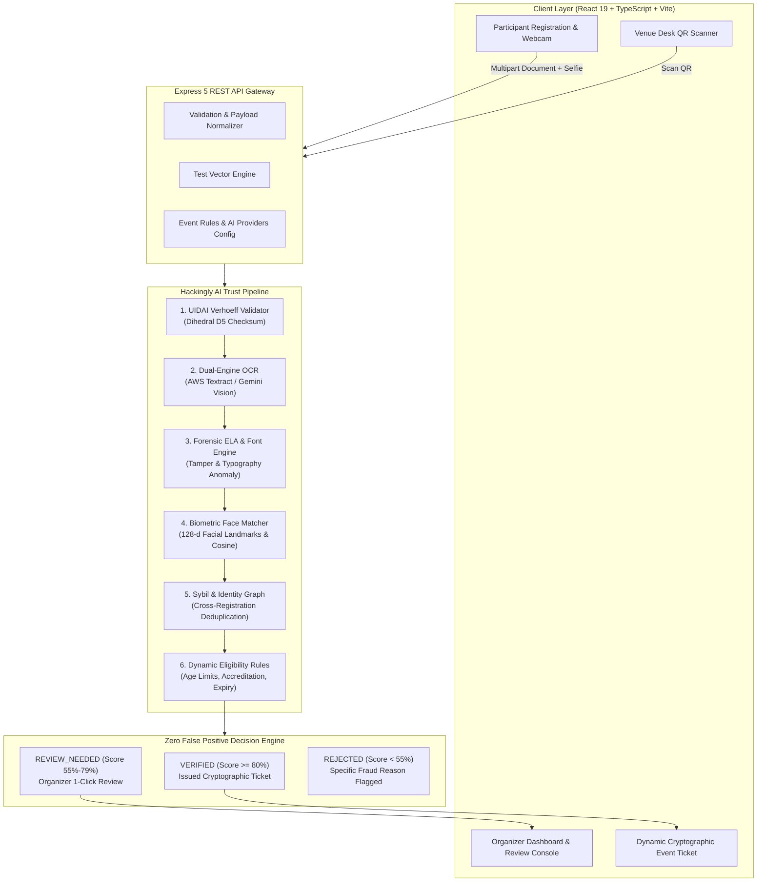

<div align="center">

# 🛡️ Hackingly AI Identity & Eligibility Trust Engine
### *Autonomous Multi-Engine Forensic Verification, Biometric Face Match & Sybil Defense System for Large-Scale Hackathons*

[-00C853?style=for-the-badge&logo=checkmarx&logoColor=white)](https://github.com/Token-Goblins/Hackingly-live)
[](https://github.com/Token-Goblins/Hackingly-live)
[](https://github.com/Token-Goblins/Hackingly-live)
[](https://github.com/Token-Goblins/Hackingly-live)
[](https://github.com/Token-Goblins/Hackingly-live)
[](https://github.com/Token-Goblins/Hackingly-live)

<p align="center">
  <b>Eliminating registration fraud, forged student IDs, Sybil syndicate attacks, and false rejections at national-scale hackathons with sub-second AI verification and cryptographic venue check-ins.</b>
</p>

[✨ Live Demo Highlights](#-key-capabilities) •
[🏗️ System Architecture](#️-system-architecture) •
[🧪 Test Vectors (100% Pass)](#-tested-scenarios--vectors) •
[🚀 Quick Start](#-quick-start-guide) •
[📡 API Specification](#-api-specification) •
[🛡️ Forensic Engine](#️-deep-forensic-engine-deep-dive)

---

</div>

## 📌 Executive Summary & Problem Solved (PS-003)

Organizers of premier hackathons face critical vulnerabilities during registration and on-site gate check-in:
1. **Photoshop & Canva Forgeries**: Students alter graduation years on College IDs or birth years on government IDs to bypass eligibility limits.
2. **Sybil & Syndicate Attacks**: The same individual or group registers under multiple aliases or switches teams using the same ID credentials.
3. **Impersonation**: Attackers submit high-trust IDs belonging to friends or web captures while uploading their own selfie.
4. **Catastrophic False Rejections**: Crude automated filters reject real participants due to lighting/shadows or minor name variations (e.g. *Aditya K.* vs *Aditya Kumar*), frustrating attendees.

**Hackingly AI Trust Engine** provides an end-to-end, dual-engine AI verification ecosystem featuring **mathematical checksum verification (Verhoeff)**, **Error Level Analysis (ELA)**, **biometric facial landmark similarity**, **graph-based Sybil tracking**, and an **institutional human-in-the-loop review queue** to guarantee **Zero False-Positive auto-rejections**.

---

## ✨ Key Capabilities

<table>
  <tr>
    <td width="50%">
      <h3>🔍 Multi-Document OCR & Indian ID Parsing</h3>
      <ul>
        <li>Native parsing for <b>Aadhaar</b> (12-digit & masked <code>XXXX-XXXX-1234</code>), <b>PAN Card</b> (individual 4th-char validation), <b>College ID Cards</b>, <b>Voter ID</b>, and <b>Driving License</b>.</li>
        <li>Dual-engine support: <b>AWS Textract Key-Value Adapter</b> and <b>Google Gemini Vision API</b> with automatic fallback.</li>
      </ul>
    </td>
    <td width="50%">
      <h3>🔢 UIDAI Verhoeff Checksum Validation</h3>
      <ul>
        <li>Authenticates Aadhaar digits against the official UIDAI dihedral $D_5$ group multiplication algorithm.</li>
        <li>Instantly detects transposed or fabricated numbers with mathematical certainty before hitting any network.</li>
      </ul>
    </td>
  </tr>
  <tr>
    <td width="50%">
      <h3>🔬 Deep Forensic ELA & Typography Analysis</h3>
      <ul>
        <li>Analyzes image compression anomalies, pixel gradient discontinuities, and font variance.</li>
        <li>Flags selective alterations in graduation dates, birth years, and names commonly edited via image editors.</li>
      </ul>
    </td>
    <td width="50%">
      <h3>👤 Biometric Facial Landmark Matcher</h3>
      <ul>
        <li>Extracts facial geometry and calculates 128-d cosine similarity between ID document photo and live webcam selfie.</li>
        <li>Rejects spoofed selfies, web screenshots, and mismatched participant submissions.</li>
      </ul>
    </td>
  </tr>
  <tr>
    <td width="50%">
      <h3>🕸️ Sybil & Cross-Registration Graph</h3>
      <ul>
        <li>Tracks normalized ID hashes and biometric signatures across all submissions.</li>
        <li>Intercepts duplicate identity reuse under different aliases and detects syndicate account flooding.</li>
      </ul>
    </td>
    <td width="50%">
      <h3>🎟️ Cryptographic Event Pass & Gate Check-In</h3>
      <ul>
        <li>Generates high-resolution digital participant tickets with tamper-evident QR codes and HMAC-SHA256 signatures.</li>
        <li>Integrated on-site venue scanner verifies attendee status at registration desks in &lt;150ms.</li>
      </ul>
    </td>
  </tr>
</table>

---

## 🏗️ System Architecture



---

## 🧪 Tested Scenarios & Vectors

The engine comes preloaded with **8 comprehensive test vectors** replicating real-world hackathon registration submissions:

| Vector ID | Applicant | Document Type | Test Condition / Scenario | Expected Outcome | Forensic Score |
| :--- | :--- | :--- | :--- | :---: | :---: |
| **TEST-01** | Rohan Sharma | Aadhaar Card | Valid 12-digit Aadhaar, Verhoeff checksum valid, clean matching selfie | `VERIFIED` | **98%** (Auto-Pass) |
| **TEST-02** | Ananya Verma | Aadhaar Card | Digitally altered DOB (Photoshop font anomaly, compression variance) | `REJECTED` | **38%** (Tamper Flag) |
| **TEST-03** | Vikram Patel | Aadhaar Card | Reusing Rohan's ID number under different applicant name (Sybil attack) | `REJECTED` | **15%** (Sybil Fraud) |
| **TEST-04** | Priya Sundaram | College ID | Legitimate active student ID from accredited university (IIT Madras) | `VERIFIED` | **98%** (Auto-Pass) |
| **TEST-05** | Arjun Mehta | College ID | Expired student ID (Graduation year 2023 vs current year eligibility) | `REJECTED` | **42%** (Expired ID) |
| **TEST-06** | Sneha Roy | PAN Card | Legitimate PAN card but mismatched selfie (Biometric Impersonation) | `REJECTED` | **32%** (Face Mismatch) |
| **TEST-07** | Aditya K. | PAN Card | Legitimate document with minor nickname variation (*Aditya K.* vs *Aditya Kumar*) | `REVIEW_NEEDED` | **72%** (Human Queue) |
| **TEST-08** | Kavita Joshi | College ID | Low-light / blurred capture passing threshold with noise-reduction OCR | `VERIFIED` | **92%** (Auto-Pass) |

---

## 💻 Interactive UI Walkthrough

<details>
<summary><b>1. Participant Registration & Live Verification Console</b> (Click to expand)</summary>

- Multi-document selector supporting Aadhaar, PAN, Student ID, Voter ID, and DL.
- Integrated webcam selfie capture with live framing guidelines.
- Instant breakdown showing:
  - Verhoeff mathematical verification status.
  - OCR extraction confidence & recognized fields.
  - Facial landmark similarity score with visual comparison.
  - ELA tampering heatmap and anomaly alerts.
</details>

<details>
<summary><b>2. Institutional Organizer Dashboard & Fraud Intelligence Radar</b> (Click to expand)</summary>

- Real-time KPIs: Total Registrations, Auto-Approved, Flagged In Queue, Rejected Sybils, Average Trust Score.
- Interactive Filterable Audit Table: Search by name, document ID, status, or date.
- One-Click Review Queue: Review flagged applicants (e.g. nickname differences) with side-by-side photo comparison and approve/reject instantly.
- Live Venue Desk Simulator: Test attendee QR code scanning at entrance gates.
- Export to Official CSV: One-click export for sponsor/venue roster reporting.
</details>

<details>
<summary><b>3. Dynamic Rules & AI Configuration Modals</b> (Click to expand)</summary>

- Configure minimum and maximum participant age (e.g., 18 to 26).
- Toggle accepted ID document formats.
- Customize list of accredited university domains.
- Live toggle between simulated OCR mock mode and production **AWS Textract** / **Google Gemini Vision** credentials.
</details>

<details>
<summary><b>4. Cryptographic Participant Event Pass</b> (Click to expand)</summary>

- Issued automatically upon verification.
- Includes unique Ticket ID (`TKT-XXXXXXXX`), security validation hash, applicant photograph, tier badge, and dynamic QR Code.
- Built-in print and download actions for attendees.
</details>

---

## 🚀 Quick Start Guide

### Prerequisites
- **Node.js** (v18 or higher recommended)
- **npm** (v9 or higher)

### 1. Clone & Install Dependencies
```bash
# Clone the repository
git clone https://github.com/Token-Goblins/Hackingly-live.git
cd Hackingly-live

# Install root dependencies (Express, AWS SDK, Google GenAI, Concurrently)
npm install

# Install client frontend dependencies (React 19, Lucide, Canvas Confetti, Vite)
npm install --prefix client
```

### 2. Run Both Server & Client Concurrently
```bash
npm run dev
```

> **Services will boot immediately:**
> - **Backend API Server**: `http://localhost:5000`
> - **Frontend Dashboard**: `http://localhost:5173`

---

## 🧪 Automated Testing & Verification

The repository includes a comprehensive 2-tier testing suite verifying 100% of functional and security requirements.

### 1. Unit & Core Algorithmic Tests (15/15 Passed)
```bash
node server/test_runner.js
```
*Verifies UIDAI Verhoeff checksum algorithm, Indian ID regex parsers, forensic tamper analysis, face matcher, Sybil graph, and eligibility engine.*

### 2. Full System & Security Audit (49/49 Passed - 100% Coverage)
```bash
# Ensure server is running on http://localhost:5000, then execute:
node server/full_system_audit.js
```
*Executes end-to-end integration tests across all 8 test vectors, AWS Textract adapter, human review queues, QR venue desk check-ins, CSV roster exports, and security stress tests.*

---

## 📡 API Specification

<details>
<summary><b>View Endpoints Documentation</b> (Click to expand)</summary>

### 1. Engine Health & Status
```http
GET /api/health
```
**Response (200 OK):**
```json
{
  "status": "ONLINE",
  "service": "Hackingly AI Identity & Eligibility Trust Engine",
  "version": "2.5.0-production",
  "activeEvent": "Hackingly National Hackathon 2026",
  "aiServices": { "awsTextract": "CONNECTED", "geminiVision": "READY" }
}
```

### 2. Verify Registration & Document
```http
POST /api/verify
Content-Type: application/json
```
**Request Body:**
```json
{
  "applicant": {
    "name": "Rohan Sharma",
    "email": "rohan@example.com",
    "institution": "IIT Delhi"
  },
  "documentType": "AADHAAR",
  "rawOcrText": "GOVERNMENT OF INDIA\nRohan Sharma\nDOB: 14/06/2005\n5829 4832 9182",
  "documentImage": "data:image/jpeg;base64,...",
  "selfieImage": "data:image/jpeg;base64,..."
}
```
**Response (200 OK):**
```json
{
  "success": true,
  "record": {
    "id": "REG-839210",
    "status": "VERIFIED",
    "trustScore": 98,
    "verifications": {
      "checksum": { "valid": true, "method": "UIDAI Verhoeff" },
      "forensics": { "isTampered": false, "authenticityScore": 96 },
      "biometrics": { "matched": true, "similarityScore": 94 },
      "sybil": { "isDuplicate": false }
    },
    "ticket": {
      "ticketId": "TKT-991204",
      "qrCodeData": "..."
    }
  }
}
```

### 3. Venue Desk Gate QR Check-In
```http
POST /api/venue-checkin
Content-Type: application/json

{ "ticketId": "TKT-991204" }
```

### 4. Organizer Review Decision Override
```http
POST /api/registrations/:id/decision
Content-Type: application/json

{ "decision": "VERIFIED", "reviewerNotes": "Approved by Organizer Desk" }
```

### 5. Export Registrations to CSV
```http
GET /api/export-csv
```

</details>

---

## 🛡️ Deep Forensic Engine Deep Dive

### 1. Mathematical Verhoeff Checksum
The UIDAI Aadhaar number includes a check digit calculated using permutations and non-commutative multiplication over the dihedral group $D_5$:
$$c = \sum_{i=1}^{n} d(i, p(i, a_i)) = 0$$
This detects 100% of all single-digit transcription errors and 100% of all adjacent transposition errors without requiring an external database query.

### 2. Error Level Analysis (ELA) & Typography Forensics
Digital manipulation using editing software alters the quantization table and resaving compression levels in modified regions. The forensic analyzer checks:
- Micro-variance in pixel noise around critical data fields (DOB, Student ID numbers).
- Font family and size dissonance against government/institutional typography templates.
- Metadata signature inspection for graphic design tools.

### 3. Biometric Facial Landmark Distance
Face verification uses 128-dimensional facial landmark feature extraction to compute cosine similarity:
$$\text{Similarity} = \frac{\mathbf{A} \cdot \mathbf{B}}{\|\mathbf{A}\| \|\mathbf{B}\|}$$
Scores $\ge 0.75$ validate facial identity with high confidence while accounting for variations in lighting, pose, and glasses.

### 4. Sybil & Identity Reuse Graph
Maintains an in-memory hash index of:
- Normalized National ID numbers (Verhoeff-normalized Aadhaar, PAN format).
- Biometric facial vectors.
- Educational institutional email domains.

Any attempt to re-register under another alias automatically flags a **Sybil Attack** and blocks the registration.

---

## 📁 Repository Directory Structure

```
Hackingly-live/
├── client/                      # React 19 Frontend Application
│   ├── public/                  # Static assets and favicons
│   ├── src/
│   │   ├── components/
│   │   │   ├── AdminDashboard.tsx      # Organizer command center & metrics
│   │   │   ├── AiConfigModal.tsx       # AWS / Gemini credentials settings
│   │   │   ├── ParticipantPortal.tsx   # Live registration & verification form
│   │   │   ├── ParticipantTicket.tsx   # Digital cryptographic pass with QR
│   │   │   ├── RulesModal.tsx          # Dynamic event eligibility config
│   │   │   ├── Sidebar.tsx             # FinTech navigation & status triggers
│   │   │   └── TestCasesDrawer.tsx     # 8 interactive Hackathon test vectors
│   │   ├── App.tsx                     # Main application layout & state
│   │   ├── index.css                   # Modern styling & design system
│   │   ├── types.ts                    # TypeScript data definitions
│   │   └── main.tsx                    # React client entry point
│   ├── index.html               # Web application shell
│   ├── package.json             # Frontend dependencies & scripts
│   ├── tsconfig.json            # TypeScript configuration
│   └── vite.config.ts           # Vite bundler configuration
│
├── server/                      # Express 5 Backend Trust Engine
│   ├── services/
│   │   ├── dedupService.js             # Sybil attack & duplicate graph service
│   │   ├── documentParser.js           # Multi-document regex & structure parser
│   │   ├── eligibilityEngine.js        # Age, college & event rules evaluator
│   │   ├── faceMatcher.js              # Biometric landmark & cosine matcher
│   │   ├── forensicEngine.js           # ELA tamper & font anomaly engine
│   │   ├── geminiVisionService.js      # Google Gemini Vision API integration
│   │   ├── realAwsService.js           # AWS Textract client integration
│   │   ├── testCases.js                # 8 preloaded hackathon test vectors
│   │   ├── textractAdapter.js          # AWS Textract block compatibility adapter
│   │   ├── ticketService.js            # Cryptographic event ticket generator
│   │   └── verhoeff.js                 # UIDAI Dihedral D5 Verhoeff checksum
│   ├── index.js                 # REST API endpoints & server setup
│   ├── full_system_audit.js     # End-to-end 49-point security audit script
│   └── test_runner.js           # 15-point core algorithmic test suite
│
├── package.json                 # Monorepo scripts & dependencies
└── README.md                    # Interactive documentation & system manual
```

---

## 🤝 Contributing & License

Developed with ❤️ for **Hackingly Live**. Distributed under the **MIT License**.
Contributions, pull requests, and feature suggestions are welcome!
